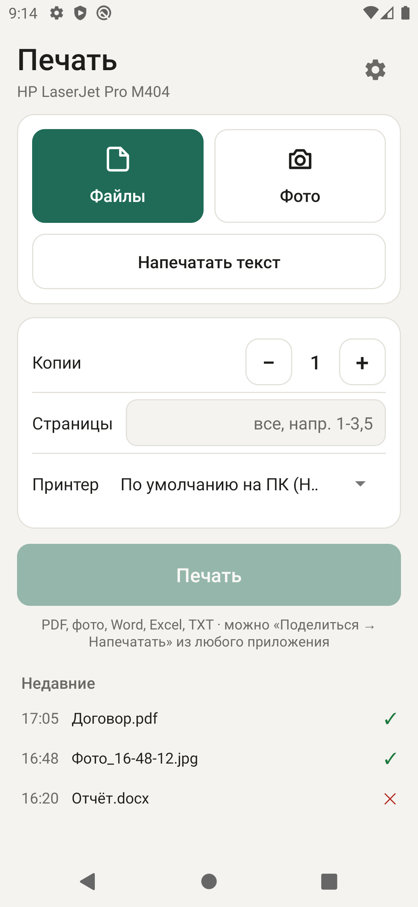
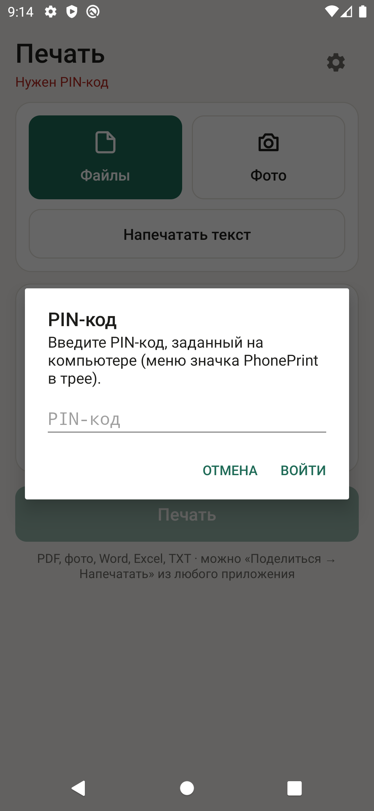
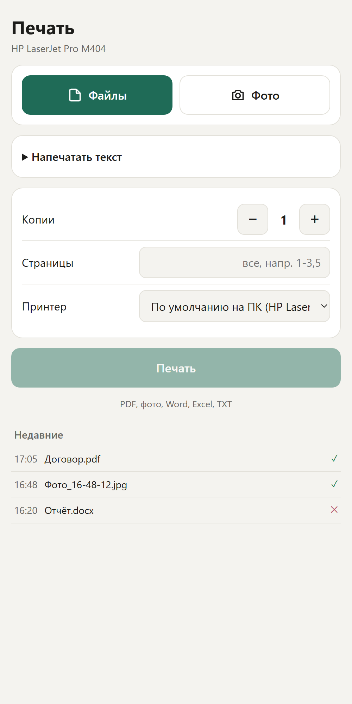
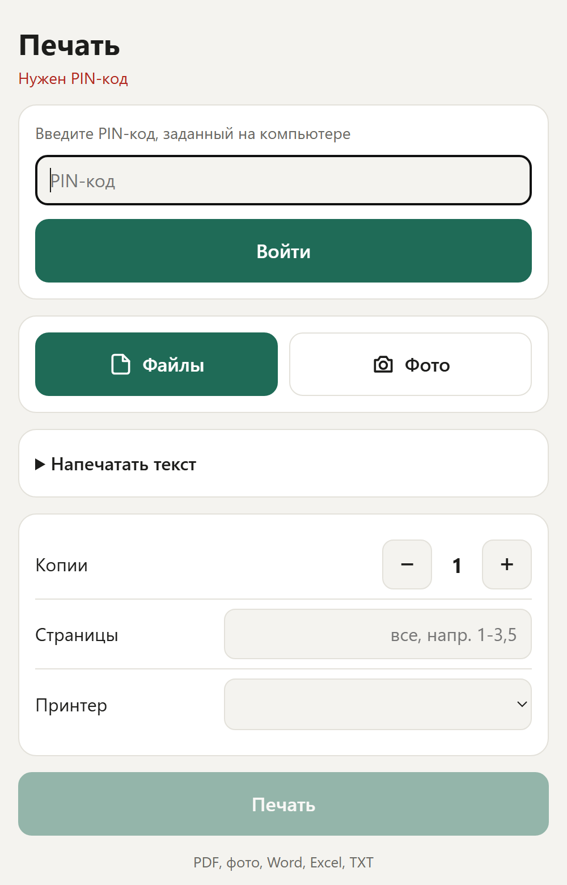

# PhonePrint — печать с телефона на принтер через ПК

Печать с Android-телефона (или из браузера телефона) на принтер, подключённый к Windows-компьютеру.
На ПК в трее работает небольшой HTTP-сервер на PowerShell. Телефон отправляет ему файл, ПК печатает на принтер
**по умолчанию в Windows** (или на выбранный вручную).

```
Телефон (приложение «Печать» / браузер)  ──Wi-Fi, HTTP :8080──►  ПК: PhonePrint.ps1  ──►  принтер Windows
```

## Скриншоты

| Приложение | Запрос PIN-кода | Веб-страница | Веб-страница: PIN |
|:--:|:--:|:--:|:--:|
|  |  |  |  |

(Скриншоты сделаны на демонстрационных данных: названия принтеров и файлов вымышлены.)


---

## 1. Состав проекта

```
PhonePrint\
├─ PhonePrint.ps1      сервер + значок в трее (основная программа на ПК)
├─ PhonePrint.vbs      запуск PhonePrint.ps1 без окна консоли (на него ссылается автозагрузка)
├─ setup.cmd / .ps1    одноразовая настройка: порт, брандмауэр, автозагрузка (просит права администратора)
├─ web\index.html      веб-страница для печати из браузера телефона
├─ PhonePrint.apk      собранное Android-приложение (раздаётся по http://<ПК>:8080/app)
├─ phoneprint.pin      хэш PIN-кода (создаётся из меню трея; в git не попадает)
├─ phoneprint.log      журнал печати (создаётся сам, переносить не обязательно)
└─ android\            исходники Android-приложения (Kotlin, Gradle)
   ├─ app\src\main\java\ru\phoneprint\MainActivity.kt   экран, «Поделиться», камера, печать
   ├─ app\src\main\java\ru\phoneprint\Net.kt            HTTP-запросы и поиск ПК в сети
   ├─ app\src\main\res\...                              разметка, цвета, иконки
   ├─ app\build.gradle.kts                              версия приложения, SDK, подпись
   ├─ build.cmd                                         сборка APK одной командой
   ├─ phoneprint.jks + keystore.properties              КЛЮЧ ПОДПИСИ (см. раздел 5)
   └─ local.properties                                  путь к Android SDK на этом ПК
```

Служебные папки `android\.gradle`, `android\build`, `android\app\build`, `android\.kotlin` — кэш сборки,
переносить не нужно (пересоздаются).

---

## 2. Что нужно на компьютере с принтером

| Что | Зачем | Обязательно |
|---|---|---|
| Windows 10/11, PowerShell 5.1 | сервер | да (есть в Windows) |
| **Ghostscript** — `setup.cmd` ставит его сам, если не найдёт (см. ниже); подойдёт и из [PDF24 Creator](https://www.pdf24.org) | печать PDF без окон | да |
| Microsoft Word | печать DOC/DOCX/RTF/ODT/TXT | нет, только для этих форматов |
| Microsoft Excel | печать XLS/XLSX/CSV/ODS | нет, только для этих форматов |
| Драйвер принтера в Windows | — | да |

Где сервер ищет Ghostscript (по порядку):
`C:\Program Files\PDF24\gs\bin\gswin64c.exe` → `C:\Program Files (x86)\PDF24\gs\bin\gswinc.exe` → `C:\Program Files\gs\gs*\bin\gswin64c.exe`.
Если стоит в другом месте — поправить функцию `Find-Ghostscript` в `PhonePrint.ps1` (и такую же в `setup.ps1`).

**Автоустановка.** Если Ghostscript не найден, `setup.cmd` сначала ставит его из папки `redist` (она есть в архиве
`PhonePrint-<версия>-windows.zip` из раздела Releases — тогда интернет не нужен), а если папки нет — скачивает последний официальный установщик
с [github.com/ArtifexSoftware/ghostpdl-downloads](https://github.com/ArtifexSoftware/ghostpdl-downloads) (около 65 МБ, нужен интернет)
и тихо ставит его в `C:Program Filesgs`. Не хотите — `setup.cmd -NoGhostscript`. Если скачать не удалось, настройка порта и
автозагрузки всё равно завершится, а Ghostscript придётся поставить вручную. Ghostscript распространяется под лицензией AGPL
(см. `THIRD-PARTY.txt`) и в git-репозиторий не входит: он лежит только в архиве релиза.

---

## 3. Перенос программы на другой ПК (чек-лист)

**На старом ПК** (если он больше не будет печатать):

1. Значок в трее → **Выход**.
2. Отменить настройку: в папке проекта выполнить `setup.cmd -Uninstall` (закроет порт, уберёт из автозагрузки).

**На новом ПК:**

1. Скопировать папку `PhonePrint` целиком (можно без `android\`, если не собираетесь пересобирать приложение —
   но **ключ подписи сохраните где-нибудь обязательно**, см. раздел 5).
   Путь — любой; лучше без пробелов и кириллицы, например `D:\PhonePrint`.
2. При необходимости установить Word/Excel (Ghostscript поставит `setup.cmd` на шаге 4).
3. Назначить нужный принтер **принтером по умолчанию** в Windows.
4. Запустить **`setup.cmd`** → «Да» в окне UAC. Он:
   - резервирует адрес `http://+:8080/` для текущего пользователя (`netsh http add urlacl`);
   - открывает TCP 8080 в брандмауэре только для локальной подсети (правило «PhonePrint»);
   - скачивает и ставит Ghostscript, если его ещё нет;
   - кладёт ярлык `PhonePrint.lnk` в автозагрузку пользователя (указывает на `PhonePrint.vbs` в текущей папке);
   - запускает программу.
5. На телефоне открыть приложение — оно само найдёт новый ПК в сети. Если нет: ⚙ → «Найти» или ввести адрес
   вручную (адрес виден в меню значка в трее).

> ⚠️ **Если папку перенесли/переименовали после установки** — снова запустить `setup.cmd`,
> иначе ярлык автозагрузки будет указывать на старое место.
>
> ⚠️ `setup` привязан к **пользователю Windows**. Для другой учётной записи — запустить `setup.cmd` из-под неё.

**Проверка без бумаги:**

```bat
powershell -NoProfile -ExecutionPolicy Bypass -STA -File PhonePrint.ps1 -Port 18080 -LocalOnly -DryRun
```

Вместо печати складывает PDF в `%TEMP%\PhonePrint`. Страница: `http://localhost:18080/`.
(Если основная копия уже запущена — сначала выйти из неё через трей.)

---

## 4. PIN-код (защита от чужих)

Без PIN печатать и смотреть историю заданий может любой в вашей Wi-Fi сети. Чтобы закрыть доступ:

1. Значок в трее → **Задать PIN-код…** → ввести 4–8 цифр дважды.
2. На телефоне (приложение или браузер) при первом подключении появится запрос PIN; он запоминается на устройстве.
   В приложении его можно изменить в ⚙.
3. **Сменить PIN-код…** / **Убрать PIN-код** — там же, в меню трея.

Как это работает: на ПК хранится только хэш (соль + SHA-256) в `phoneprint.pin`. После 5 неверных попыток подряд
с одного адреса доступ с него блокируется на 60 секунд. Страница `/qr` и скачивание приложения `/app` PIN не требуют
(иначе приложение не поставить). ⚠️ PIN передаётся по обычному HTTP внутри локальной сети — это защита от случайных
и любопытных, а не от злоумышленника, который перехватывает трафик Wi-Fi. Не используйте PhonePrint в чужих сетях.

---

## 5. Двусторонняя печать

На экране печати (приложение и веб-страница) есть галочка **«Двусторонняя печать»**. Она видна только если драйвер выбранного
принтера сообщает, что умеет печатать на обеих сторонах листа (проверяется через `PrintCapabilities`, результат кэшируется на 2 минуты).
Печать идёт по длинному краю (как книга). Работает для PDF, Word, Excel и TXT; для фото не применяется.
Если копий несколько, каждая печатается отдельным заданием, чтобы следующая копия начиналась с нового листа.

⚠️ «Поддерживает» — это то, что заявляет **драйвер**. Универсальные драйверы (например, HP Universal Printing) могут показывать
дуплекс, даже если в самом принтере нет блока двусторонней печати — тогда принтер напечатает всё с одной стороны.
Проверьте один раз на своём принтере.

---

## 6. Настройки сервера

Параметры `PhonePrint.ps1`:

| Параметр | По умолчанию | Описание |
|---|---|---|
| `-Port` | `8080` | порт. При смене: `setup.cmd -Port N`, дописать `-Port N` в строку запуска в `PhonePrint.vbs`, на телефоне ввести адрес вручную (автопоиск ищет только 8080 — константа `Net.PORT` в `Net.kt`) |
| `-Printer` | пусто | имя принтера «по умолчанию для сервера»; пусто = принтер по умолчанию Windows |
| `-DryRun` | выкл. | пробный режим: PDF в `%TEMP%\PhonePrint` вместо печати |
| `-LocalOnly` | выкл. | слушать только localhost (для отладки, не требует setup) |

Как выбирается принтер для задания: имя из запроса (если такой принтер есть) → `-Printer` → принтер по умолчанию Windows
(определяется в момент печати, так что смена принтера по умолчанию действует сразу).

Виртуальные принтеры («Microsoft Print to PDF», XPS, PDF24, OneNote, Fax) открывают на ПК окно «Сохранить как» —
задание висит, пока его не закроют. Не делайте их принтером по умолчанию.

Рабочие файлы: временные — `%TEMP%\PhonePrint` (удаляются после печати), журнал — `phoneprint.log` рядом со скриптом.

---

## 7. Android-приложение

**Установка на телефон:** значок в трее → «Установить приложение на телефон (QR-код)» →
отсканировать или открыть в браузере телефона `http://<IP-ПК>:8080/app` → открыть скачанный APK →
разрешить установку из браузера.

Возможности: «Поделиться → Напечатать» из любого приложения (в т.ч. несколько файлов), выбор файлов, фото с камеры,
печать набранного текста, копии, диапазон страниц, **двусторонняя печать** (галочка появляется, только если выбранный принтер её поддерживает), выбор принтера (по умолчанию — «По умолчанию на ПК»),
автопоиск ПК в сети (перебор `x.x.x.1–254:8080`), история заданий, тёмная тема.

| | |
|---|---|
| Пакет | `ru.phoneprint` |
| Версия | `versionCode 5`, `versionName 1.2` |
| minSdk / target / compile | 26 (Android 8) / 35 / 35 |
| Зависимости | только `androidx.core:core-ktx:1.13.1` |
| Инструменты | JDK 17, Gradle 8.11.1, AGP 8.7.3, Kotlin 2.0.21, build-tools 35.0.0 |

### 🔑 Ключ подписи — самое важное при переносе

`android\phoneprint.jks` + `android\keystore.properties` (в нём пароль).
**Без этих файлов новая сборка не установится поверх уже установленного приложения** —
придётся удалять приложение с телефона. Храните копию в надёжном месте, никуда не публикуйте
(они перечислены в `android\.gitignore`).

### Сборка на другом ПК

Вариант А — **Android Studio**: открыть папку `android\`, Studio сама поставит SDK и пропишет `local.properties`.
Сборка: *Build → Generate Signed App Bundle / APK* или `gradlew assembleRelease` в терминале Studio.
APK: `android\app\build\outputs\apk\release\app-release.apk` → скопировать в корень как `PhonePrint.apk`.

Вариант Б — **без Studio, как сейчас** (инструменты в `D:\android-tools`, ~1,8 ГБ):

1. Перенести папку `D:\android-tools` целиком (папку `dl` с архивами можно не переносить)
   **или** поставить заново: JDK 17 (Temurin), Android command-line tools →
   `sdkmanager "platforms;android-35" "build-tools;35.0.0" "platform-tools"` (+ `sdkmanager --licenses`),
   Gradle 8.11.1.
2. Если путь не `D:\android-tools` — задать переменную `TOOLS` (`set TOOLS=C:\android-tools`) или
   `JAVA_HOME` / `ANDROID_HOME`, и прописать `sdk.dir` в `android\local.properties`
   (образец — `local.properties.example`).
3. Запустить `android\build.cmd` — готовый APK сам копируется в `PhonePrint\PhonePrint.apk`,
   откуда его раздаёт сервер.

**Перед каждой новой сборкой для телефона** увеличить `versionCode` (и при желании `versionName`)
в `android\app\build.gradle.kts`.

---

## 8. HTTP API (для справки / доработок)

| Метод и путь | Что делает |
|---|---|
| `GET /` | веб-страница печати (`web\index.html`, читается с диска при каждом запросе) |
| `GET /qr` | страница с QR-кодом на `/app` (для экрана ПК; QR рисуется библиотекой с cdnjs — нужен интернет) |
| `GET /app` | скачать `PhonePrint.apk` |
| `GET /api/info` | (нужен PIN, если задан) JSON: `app`, `printer` (текущий по умолчанию), `printers[]`, `status`, `queue`, `word`, `excel`, `dryRun`, `pinRequired`, `duplex{}` (имя принтера → умеет двустороннюю печать), `history[]` |
| `POST /api/print?copies=N&pages=1-3,5&duplex=1` (`duplex=1` — двусторонняя, только если принтер её поддерживает) | тело — сырые байты файла. Заголовки: `X-Pin` (если на ПК задан PIN; без него или с неверным — `401`, при блокировке — `429`), `X-File-Name` (URL-encoded, по расширению выбирается способ печати), `X-Printer` (URL-encoded; пусто = по умолчанию). Ответ: `{ok, message, name, printer, copies, pages, time}` |

Как печатается: PDF → Ghostscript (`mswinpr2`); JPG/PNG/BMP/GIF/TIFF → .NET `PrintDocument` (по размеру листа,
авто-поворот, учёт EXIF); Word/Excel-форматы и TXT → конвертация в PDF через Word/Excel (COM) → Ghostscript.
HEIC не поддерживается.

Сервер однопоточный: запросы обрабатываются по очереди в UI-потоке (таймер WinForms), ответ на `/api/print`
приходит, когда задание передано в очередь печати Windows (таймаут Ghostscript — 15 минут).

---

## 9. Если что-то не работает

| Симптом | Что проверить |
|---|---|
| При запуске «Не удалось открыть порт 8080» | не выполнен `setup.cmd` (или выполнен от другого пользователя) |
| Телефон не находит ПК | телефон и ПК в одной сети; программа запущена (значок в трее); правило брандмауэра «PhonePrint» есть; адрес вручную в ⚙ |
| В меню трея / на QR-странице адрес `127.0.0.1` | В версии до 1.2 адрес брался только у сетевого адаптера с основным шлюзом. Сейчас выбирается лучший адрес из всех адаптеров (физический, из диапазона 192.168/10/172.16–31, со шлюзом); если всё равно `127.0.0.1` — у ПК нет рабочего IPv4-подключения к сети (проверьте кабель/Wi-Fi). Адрес можно ввести на телефоне вручную в ⚙ |
| IP компьютера всё время меняется | закрепить IP за ПК в настройках роутера (DHCP-резервирование) |
| «Не найден Ghostscript» | запустить `setup.cmd` ещё раз (он доустановит) или поставить Ghostscript / PDF24 вручную, см. раздел 2 |
| Word/Excel-файлы не печатаются | нет Office на ПК — пересохранить в PDF на телефоне |
| Задание «висит» | принтер по умолчанию — виртуальный (окно «Сохранить как» на ПК), или принтер выключен/офлайн |
| Телефон пишет «Нужен PIN-код» / «Неверный PIN» | PIN задаётся в меню значка в трее; в приложении — ⚙. Забыли — «Убрать PIN-код» или удалить `phoneprint.pin` |
| Подробности ошибки | значок в трее → «Журнал» (`phoneprint.log`) |

---

## 10. Сборка релиза

`make-release.ps1` (после сборки APK) кладёт в папку `dist`:
`PhonePrint-<версия>.apk` — отдельный APK для телефона, и `PhonePrint-<версия>-windows.zip` — программа для ПК вместе с установщиком
Ghostscript (`redist`, скачивается один раз и в git не попадает). Оба файла прикрепляйте к релизу на GitHub.

---

## 11. Лицензия и публикация

Лицензия — MIT (`LICENSE`). В git не попадают ключ подписи (`*.jks`, `keystore.properties`), `local.properties`,
журнал и APK (см. `.gitignore`); образцы — `android\keystore.properties.example`, `android\local.properties.example`.
Готовый APK выкладывайте в GitHub Releases.
